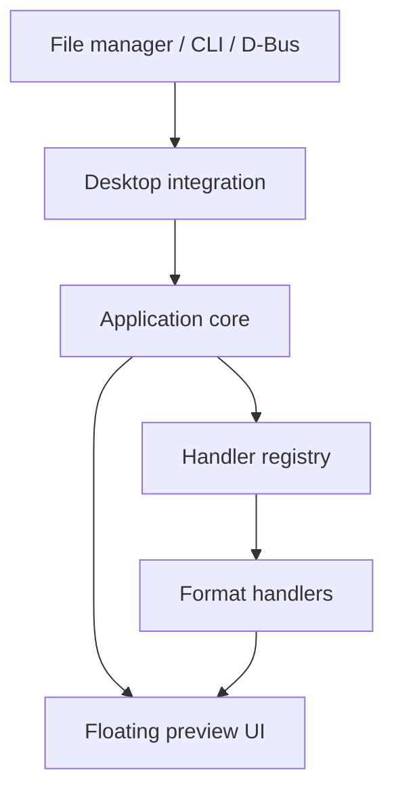

# Peek Architecture

## Implemented: Milestone 2, Task A

The application is C++17 with Qt 6 Widgets. Its current path is deliberately small:

```text
main.cpp: CLI parsing → validatePreviewPath() → PreviewWindow → Qt event loop
```

- `src/main.cpp` handles help/version, no-argument informational startup, one path operand, errors, and application lifetime. `peek PATH` is the common entry point; `peek -- PATH` protects leading-dash operands.
- `src/preview_request.h/.cpp` contain a small request/result and local existence/type validation using Qt Core. Files and directories are accepted, valid symlinks retain their spelling, and other filesystem objects are rejected. There is no content parsing, MIME probing, or directory enumeration.
- `src/preview_window.h/.cpp` implement a concrete decorated widget with plain-text name/path/status labels and Escape dismissal. Closing the only window ends the application. This is a placeholder, not a file renderer or a verified floating/compositor integration.
- Tests link Qt Test only when enabled. The production executable requires only Qt Widgets and its transitive Qt dependencies.

No Python, IPC, background service, settings framework, handler registry, file-manager integration, or single-instance behavior is implemented. Native CLI/file handling/rendering/GUI remain independent of any future thin desktop adapters. Initial validation is not a guarantee of future access; rendering must handle path changes and access errors when implemented.

## Planned direction (not implemented)

The goal is a fast, lightweight, read-only Quick Look-style preview, triggered with Space and dismissed with Escape. The following design is future intent, not a requirement to scaffold abstractions now. Wayland positioning, focus, and shortcut behavior require real desktop testing.



Dependencies point downward. Handlers and integrations know about the core's interfaces. The core knows nothing about specific formats or file managers.

## 1. Application core

Responsible for:

- Application lifecycle, single-instance behaviour (a second invocation re-targets the running instance), and command-line parsing.
- Resolving a requested path into a file description: existence, size, MIME type (via `QMimeDatabase`).
- Asking the handler registry for a handler and passing the result to the UI.
- Settings and logging.

Qt Core only, plus Widgets for the application object. Contains no format-specific code and no file-manager-specific code.

## 2. Floating preview UI

Responsible for:

- A frameless, floating, dismissible window (Escape or the trigger key closes it), sized to the content.
- Hosting a widget supplied by a handler, plus loading, error and "no preview available" states.
- Window behaviour on Wayland/Hyprland, which cannot position or focus arbitrary windows the way X11 can. Behaviour that needs compositor cooperation (floating rules, layer-shell) must be documented and kept in this layer.

The UI never parses file content.

## 3. Modular file-format handlers

Each handler turns a file into something displayable. Planned contract:

- `canHandle(mime type / file info)`, returning a score so the best handler wins.
- `createPreview(file) -> QWidget*` (or an async result), which must not block the UI thread for slow loads.
- Declared capabilities and optional dependencies.

Candidate handlers, in rough priority order: plain text/source code, images, Markdown, PDF, audio/video, archives, directories. A handler may be compiled out or disabled when its optional dependency is absent. A failing handler must degrade to a generic fallback (file name, size, type) and never crash the application.

## 4. Desktop and file-manager integrations

Thin adapters that translate an external trigger into "preview this path":

- Command line: `peek <path>`.
- Initial Nautilus selection handoff through a thin Script calling `peek -- PATH`; the right-click workflow is a testing fallback, not the final UX. Python is permitted only for thin integration when justified.
- A possible Hyprland shortcut forwarding a dedicated Nautilus Script accelerator. End-to-end reliability, focus, modifiers, and conflicting Space behavior are unverified and must pass real-session acceptance tests before adoption.
- Optional native D-Bus integration only if an approved later task justifies it; no cached-selection bridge, polling, clipboard tricks, or background daemon.
- Desktop entry and MIME associations.

Each integration lives in its own module and can be built or omitted independently. The core must work with only the command line.

## 5. Optional dependencies

The base build requires only Qt 6 Widgets. Everything else is optional and detected at configure time, with a CMake option per feature, for example:

| Feature | Possible dependency |
| --- | --- |
| PDF | Qt PDF or Poppler |
| Audio/video | Qt Multimedia (FFmpeg backend) |
| Archives | libarchive |
| Syntax highlighting | A small library, or a custom highlighter |
| D-Bus integration | Qt DBus |

Rules: missing optional dependency means that feature is disabled, not that the build fails. The README lists what each option enables. New dependencies need a justification (size, startup cost, maintenance).

## Directory layout (planned)

Directories are added only when they have content.

```
src/            application code (core, ui, handlers, integrations as it grows)
tests/          CTest tests
docs/           documentation
resources/      icons, desktop file, etc. (added when first needed)
```
