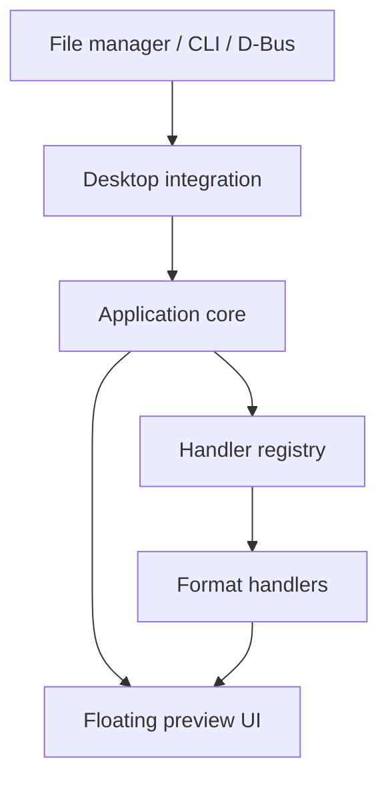

# Peek Architecture (planned)

> This document describes the **intended** design. As of Milestone 1 none of these subsystems exist. The repository contains only a minimal `src/main.cpp`.

Peek shows a quick, read-only preview of a file in a floating window. The design goals are fast startup, a small footprint, and format support that can grow without touching the rest of the program.



Dependencies point downward. Handlers and integrations know about the core's interfaces. The core knows nothing about specific formats or file managers.

## 1. Application core

Responsible for:

- Application lifecycle, single-instance behaviour (a second invocation re-targets the running instance), and command-line parsing.
- Resolving a requested path into a file description: existence, size, MIME type (via `QMimeDatabase`).
- Asking the handler registry for a handler and passing the result to the UI.
- Settings and logging.

Qt Core only, plus Widgets for the application object. Contains no format-specific code and no file-manager-specific code.

## 2. Floating preview UI

Responsible for:

- A frameless, floating, dismissible window (Escape or the trigger key closes it), sized to the content.
- Hosting a widget supplied by a handler, plus loading, error and "no preview available" states.
- Window behaviour on Wayland/Hyprland, which cannot position or focus arbitrary windows the way X11 can. Behaviour that needs compositor cooperation (floating rules, layer-shell) must be documented and kept in this layer.

The UI never parses file content.

## 3. Modular file-format handlers

Each handler turns a file into something displayable. Planned contract:

- `canHandle(mime type / file info)`, returning a score so the best handler wins.
- `createPreview(file) -> QWidget*` (or an async result), which must not block the UI thread for slow loads.
- Declared capabilities and optional dependencies.

Candidate handlers, in rough priority order: plain text/source code, images, Markdown, PDF, audio/video, archives, directories. A handler may be compiled out or disabled when its optional dependency is absent. A failing handler must degrade to a generic fallback (file name, size, type) and never crash the application.

## 4. Desktop and file-manager integrations

Thin adapters that translate an external trigger into "preview this path":

- Command line: `peek <path>`.
- D-Bus service, so file managers and scripts can request previews on a running instance.
- File-manager hooks, e.g. a Nautilus extension (`nautilus-python` is already present on Omarchy), a script/keybinding for Hyprland, and others later.
- Desktop entry and MIME associations.

Each integration lives in its own module and can be built or omitted independently. The core must work with only the command line.

## 5. Optional dependencies

The base build requires only Qt 6 Widgets. Everything else is optional and detected at configure time, with a CMake option per feature, for example:

| Feature | Possible dependency |
| --- | --- |
| PDF | Qt PDF or Poppler |
| Audio/video | Qt Multimedia (FFmpeg backend) |
| Archives | libarchive |
| Syntax highlighting | A small library, or a custom highlighter |
| D-Bus integration | Qt DBus |

Rules: missing optional dependency means that feature is disabled, not that the build fails. The README lists what each option enables. New dependencies need a justification (size, startup cost, maintenance).

## Directory layout (planned)

Directories are added only when they have content.

```
src/            application code (core, ui, handlers, integrations as it grows)
tests/          CTest tests
docs/           documentation
resources/      icons, desktop file, etc. (added when first needed)
```
